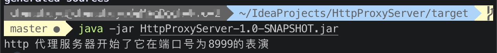
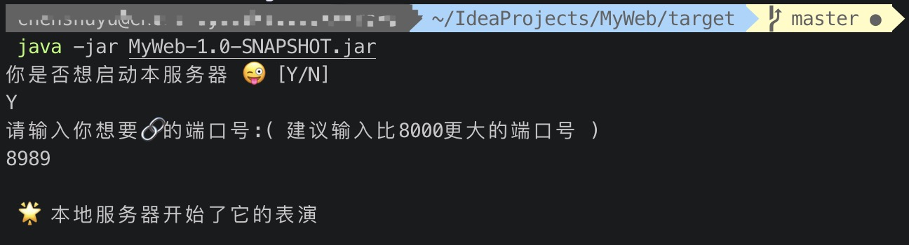
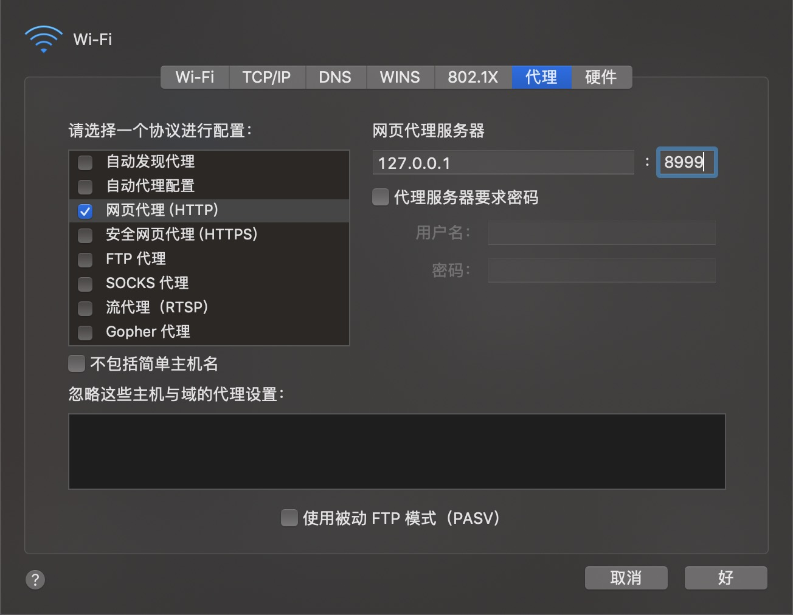
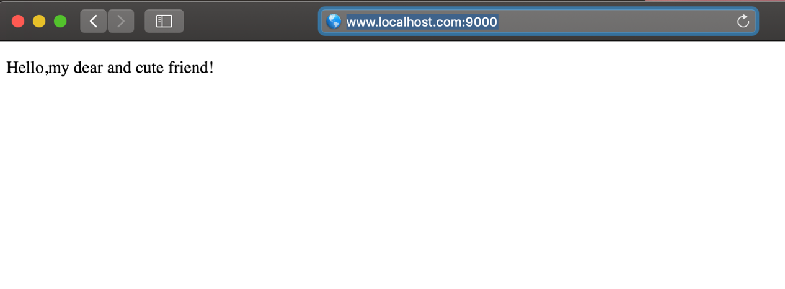
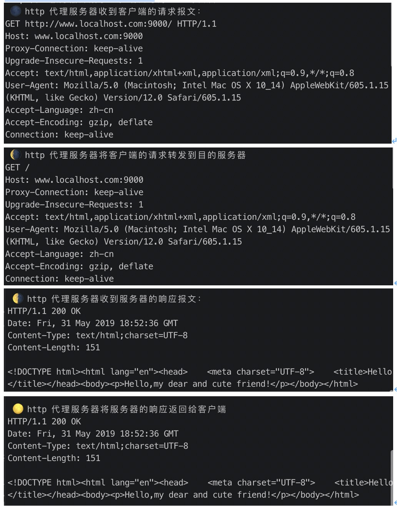

# HttpProxyServer

`JAVA` `Socket` `HttpProxy`

#### 1. 程序运行方式

1）在terminal中通过命令行运行 jar 包（target下有jar包）

 
2）由于本项目是代理服务器，测试的时候还需要服务器和客户端。所以将另一个仓库 MyWebServer 写的 web 服务器当作远程服务器，打开另一个终端窗口，运行 MyWebServer 项目作为服务器

 
3）本地的浏览器配置代理之后在浏览器访问localhost:port/…

>由于在浏览器配置的代理端口号是 8999，所以代理服务器 serversocket 端口号设置为 8999。在代码中设置的服务器和代理服务器通信的端口号是8989，所以在运行服务器的时候输入的端口号为8989。

#### 2. 使用🌰
在浏览器中输入localhost:9000，会通过代理服务器解析服务器下的默认文件index.html
（建议端口号应当大一些）

在代理服务器运行的终端会显示整个HTTP 代理过程进行的报文传输（用月亮的颜色 变化来代表整个代理过程的完成）

